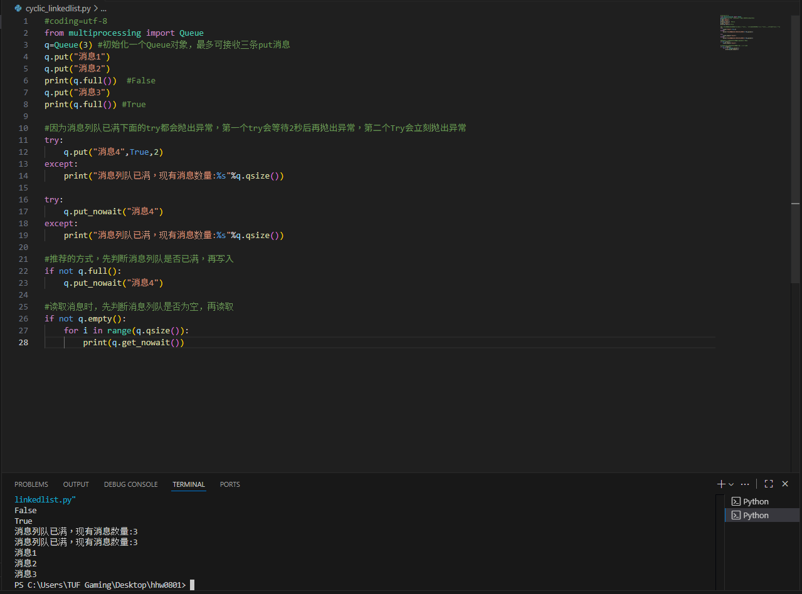
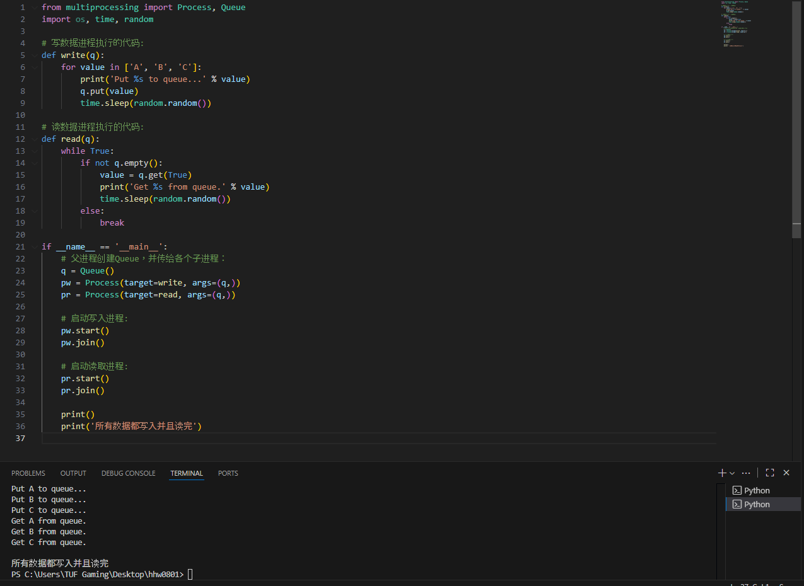
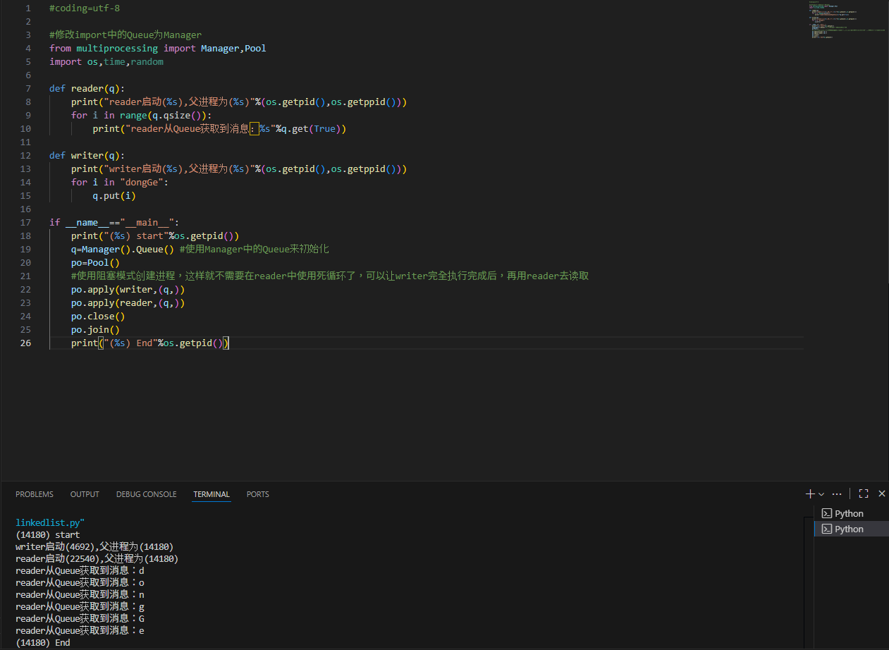

# 進程間通訊-Queue 11024151

## 一、Queue的使用
可以使用multiprocessing模組的Queue實作多進程之間的資料傳遞，Queue本身就是一個訊息列隊程序，首先用一個小實例來示範Queue的工作原理：

#coding=utf-8
from multiprocessing import Queue
q=Queue(3) #初始化一个Queue对象，最多可接收三条put消息
q.put("消息1") 
q.put("消息2")
print(q.full())  #False
q.put("消息3")
print(q.full()) #True
 
#因为消息列队已满下面的try都会抛出异常，第一个try会等待2秒后再抛出异常，第二个Try会立刻抛出异常
try:
    q.put("消息4",True,2)
except:
    print("消息列队已满，现有消息数量:%s"%q.qsize())
 
try:
    q.put_nowait("消息4")
except:
    print("消息列队已满，现有消息数量:%s"%q.qsize())
 
#推荐的方式，先判断消息列队是否已满，再写入
if not q.full():
    q.put_nowait("消息4")
 
#读取消息时，先判断消息列队是否为空，再读取
if not q.empty():
    for i in range(q.qsize()):
        print(q.get_nowait())
        

說明

初始化Queue()物件時（例如：q=Queue()），若括號中沒有指定最大可接收的訊息數量，或數量為負值，那麼就代表可接受的訊息數量沒有上限（直到記憶體的盡頭）；

Queue.qsize()：傳回目前佇列包含的訊息數量；

Queue.empty()：若佇列為空，則回傳True，反之False ；

Queue.full()：如果佇列滿了，回傳True,反之False；

Queue.get([block[, timeout]])：取得佇列中的一則訊息，然後將其從列隊移除，block預設值為True；

1）如果block使用預設值，且沒有設定timeout（單位秒），訊息列隊如果為空，此時程式將被阻塞（停在讀取狀態），直到從訊息列隊讀到訊息為止，如果設定了timeout，則會等待timeout秒，若還沒讀取到任何訊息，則拋出"Queue.Empty"異常；

2）如果block值為False，訊息列隊如果為空，則會立刻拋出"Queue.Empty"異常；

Queue.get_nowait()：相當Queue.get(False)；

Queue.put(item,[block[, timeout]])：將item訊息寫入佇列，block預設值為True；

1）如果block使用預設值，且沒有設定timeout（單位秒），訊息列隊如果已經沒有空間可寫入，此時程式將被阻塞（停在寫入狀態），直到從訊息列隊騰出空間為止，如果設定了timeout，則會等待timeout秒，若還沒空間，則拋出"Queue.Full"異常；

2）如果block值為False，訊息列隊如果沒有空間可寫入，則會立刻拋出"Queue.Full"異常；

Queue.put_nowait(item)：相當Queue.put(item, False)；

## 2.Queue實例
我們以Queue為例，在父進程中建立兩個子進程，一個往Queue裡寫數據，一個從Queue裡讀數據：

from multiprocessing import Process, Queue
import os, time, random
 
#写数据进程执行的代码:
def write(q):
    for value in ['A', 'B', 'C']:
        print 'Put %s to queue...' % value
        q.put(value)
        time.sleep(random.random())
 
读数据进程执行的代码:
def read(q):
    while True:
        if not q.empty():
            value = q.get(True)
            print 'Get %s from queue.' % value
            time.sleep(random.random())
        else:
            break
 
if __name__=='__main__':
    # 父进程创建Queue，并传给各个子进程：
    q = Queue()
    pw = Process(target=write, args=(q,))
    pr = Process(target=read, args=(q,))
    # 启动子进程pw，写入:
    pw.start()    
    # 等待pw结束:
    pw.join()
    # 启动子进程pr，读取:
    pr.start()
    pr.join()
    # pr进程里是死循环，无法等待其结束，只能强行终止:
    print ''
    print '所有数据都写入并且读完'

## 3. 進程池中的Queue
如果要使用Pool建立進程，就需要使用multiprocessing.Manager()中的Queue()，而不是multiprocessing.Queue()，否則會得到一個如下的錯誤訊息：

RuntimeError: Queue objects should only be shared between processes through inheritance.

下面的實例示範了進程池中的進程如何通訊：

#coding=utf-8
 
#修改import中的Queue为Manager
from multiprocessing import Manager,Pool
import os,time,random
 
def reader(q):
    print("reader启动(%s),父进程为(%s)"%(os.getpid(),os.getppid()))
    for i in range(q.qsize()):
        print("reader从Queue获取到消息：%s"%q.get(True))
 
def writer(q):
    print("writer启动(%s),父进程为(%s)"%(os.getpid(),os.getppid()))
    for i in "dongGe":
        q.put(i)
 
if __name__=="__main__":
    print("(%s) start"%os.getpid())
    q=Manager().Queue() #使用Manager中的Queue来初始化
    po=Pool()
    #使用阻塞模式创建进程，这样就不需要在reader中使用死循环了，可以让writer完全执行完成后，再用reader去读取
    po.apply(writer,(q,))
    po.apply(reader,(q,))
    po.close()
    po.join()
    print("(%s) End"%os.getpid())

版權聲明：本文為CSDN部落客「C-haidragon」的原創文章，遵循CC 4.0 BY-SA版權協議，轉載請附上原文出處連結及本聲明。 原文連結：https://blog.csdn.net/sinat_35360663/article/details/78338205
